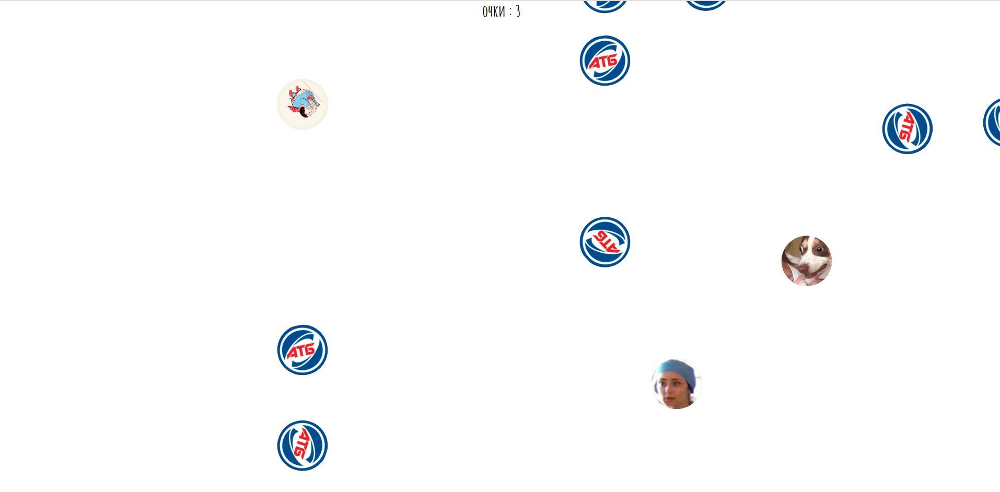

# Yasya's travel

     

## What is this?

This is non-intellectual web game about Yasya travel and travels of her brave friends, which
fight with their fears and problems.   
Easy gameplay based on mouse clicks, but have a hard levels for reaching great game results.   
Each hero has a unique gameplay and history.   

## Where can I play this?

You can play it [here](https://bringmetheaugust.github.io/yasya)🦸

## How can I deploy this?

 * run `yarn` to install all dependencies
 * run `yarn dev` to run project and enjoy game on Your *localhost:2100*

###### Required global packages:

 * *NodeJS v6+*
 * *yarn*

## Who made this?

August Luzanovsky, 2019 

## WTF?

There are also a lot of hidden heroes, which need to type secret word on main menu for their displaying).   
Good luck, cowboys!🛀🏼
